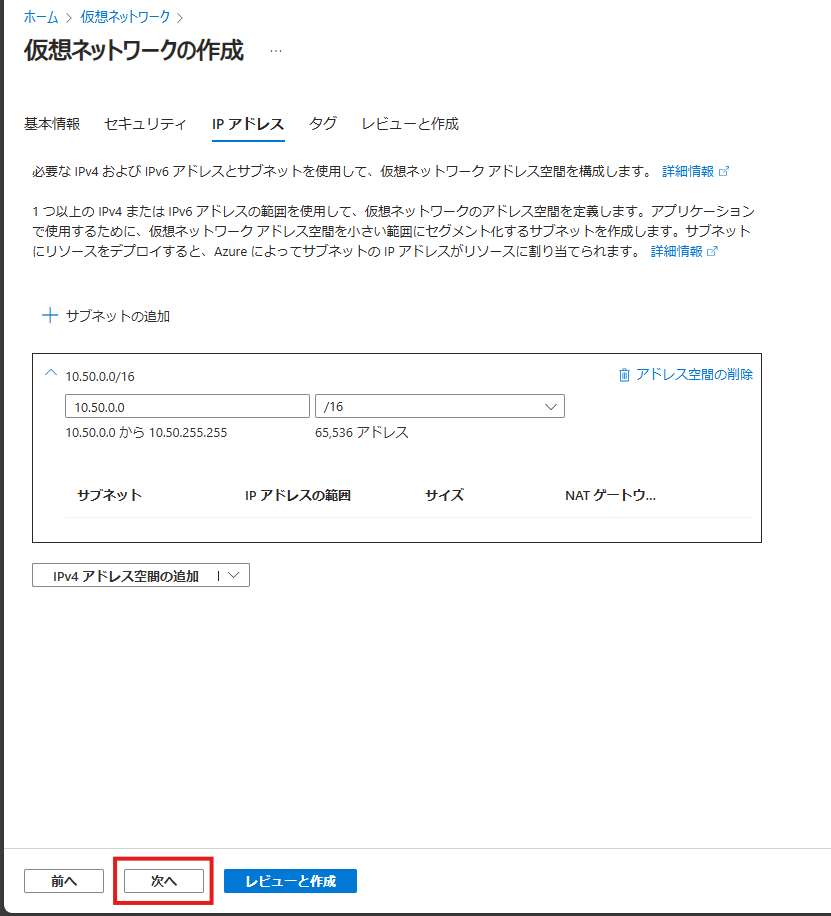
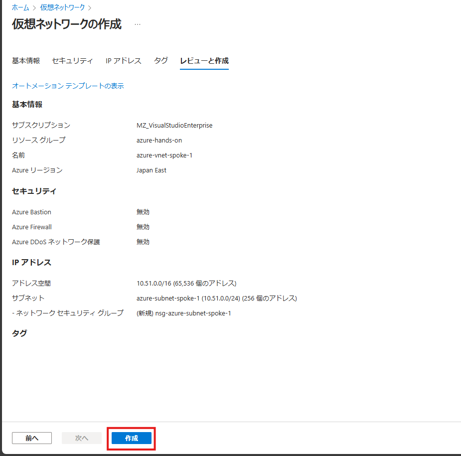
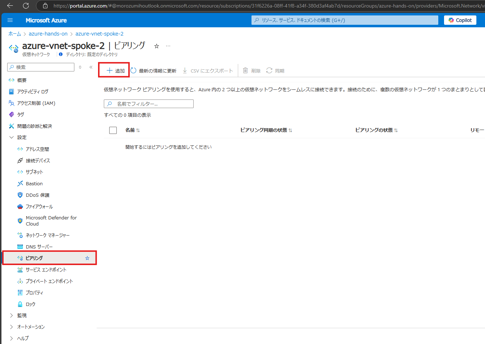
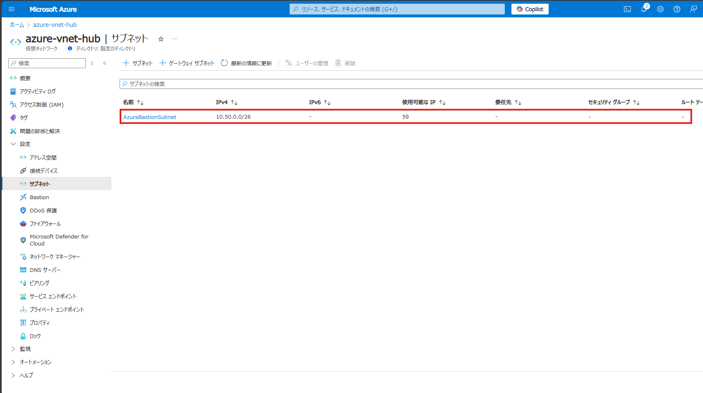
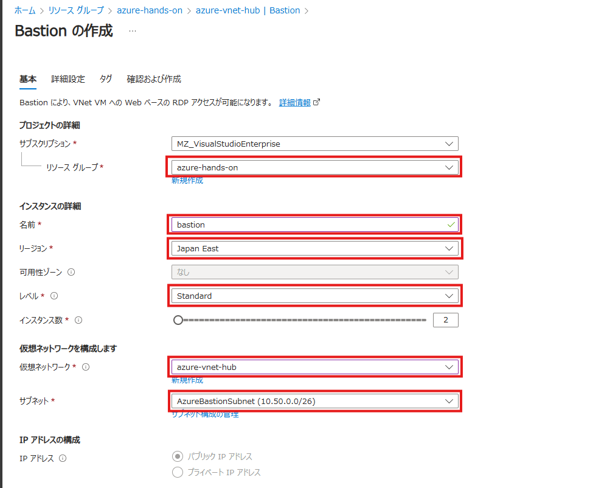
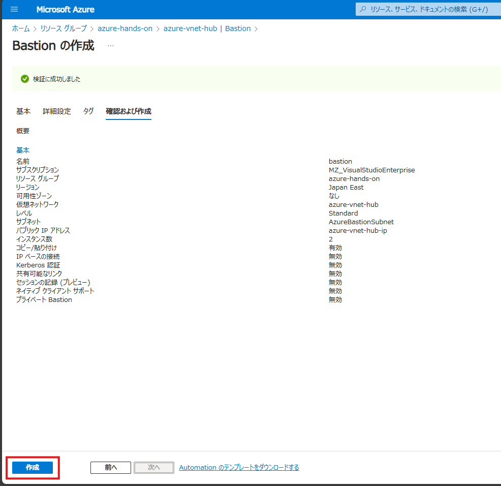

# ネットワークの構築

## 概要

このハンズオンでは、Azure 仮想ネットワークを使用して、ハブアンドスポークネットワークトポロジを構築します。このネットワークトポロジは、ハブネットワークと複数のスポークネットワークで構成されます。ハブネットワークは、オンプレミスネットワークとの接続を提供し、スポークネットワークは、Azure 仮想マシンなどのリソースをホストします。

## 作業手順

### Task 1 - リソースグループの作成

- リソースグループ名： azure-hands-on
- リージョン： Japan East

### Task 2 - Hub 仮想ネットワークの作成

- リソースグループ名： azure-hands-on（既存のリソースグループを選択）
- リージョン： Japan East
- 仮想ネットワーク名：azure-vnet-hub
- アドレス空間：10.50.0.0/16
- サブネット名：なし

### Task 3 - Spoke 仮想ネットワークの作成

今回のハンズオンでは、2つの Spoke 仮想ネットワークを作成します。以下の内容で作成してください。

- Spoke1（Windows用）
    - 仮想ネットワーク名：azure-vnet-spoke-1
    - アドレス空間：10.51.0.0/16
    - サブネット名：azure-subnet-spoke-1
    - サブネットアドレス範囲：10.51.0.0/24
    - ネットワークセキュリティグループ：nsg-azure-subnet-spoke-1
- Spoke2（Linux用）
    - 仮想ネットワーク名：azure-vnet-spoke-2
    - アドレス空間：10.52.0.0/16
    - サブネット名：azure-subnet-spoke-2
    - サブネットアドレス範囲：10.52.0.0/24
    - ネットワークセキュリティグループ：nsg-azure-subnet-spoke-2

上記の手順で Spoke1 と Spoke2 の仮想ネットワークを作成してください。

#### 完成した仮想ネットワークはこちら

### Task 4 - 仮想ネットワークのピアリング

- Spoke1 と Hub のピアリング
    - ピアリングの名前： spoke1-to-hub
    - 仮想ネットワーク： HubのVNetを選択
- Hub と Spoke1 のピアリング
    - ピアリングの名前： hub-to-spoke1
- Spoke2 と Hub のピアリング
    - ピアリングの名前： spoke2-to-hub
    - 仮想ネットワーク： HubのVNetを選択
- Hub と Spoke2 のピアリング
    - ピアリングの名前： hub-to-spoke2

### Task 5 - Bastionの作成

#### BastionSubnetの作成

#### Bastionの作成

- リソースグループ：azure-hands-on（既存のリソースグループを選択）
- 名前：bastion
- リージョン：Japan East
- レベル：Standard
- 仮想ネットワーク：azure-vnet-hub
- サブネット：AzureBastionSubnet

## まとめ

このハンズオンでは、Azure 仮想ネットワークを使用して、ハブアンドスポークネットワークトポロジを構築しました。ハブネットワークは、オンプレミスネットワークとの接続を提供やBastionなどの共通機能の提供、スポークネットワークは、Azure 仮想マシンなどのリソースをホストします。

## 次のステップ

[Exercise 2 - 仮想マシンの作成](./Exercise%202.md)　へ進みます。

## 参考資料

- [Azure Virtual Network とは](https://learn.microsoft.com/ja-jp/azure/virtual-network/virtual-networks-overview)
- [クイック スタート: Azure Portal を使用して仮想ネットワークを作成する](https://learn.microsoft.com/ja-jp/azure/virtual-network/quick-create-portal)
- [Azure Virtual Network の概念とベスト プラクティス](https://learn.microsoft.com/ja-jp/azure/virtual-network/concepts-and-best-practices)
- [仮想ネットワーク ピアリング](https://learn.microsoft.com/ja-jp/azure/virtual-network/virtual-network-peering-overview)
- [仮想ネットワークを計画する](https://learn.microsoft.com/ja-jp/azure/virtual-network/virtual-network-vnet-plan-design-arm)
- [Azure Bastion とは](https://learn.microsoft.com/ja-jp/azure/bastion/bastion-overview)
- [Azure のハブスポーク ネットワーク トポロジ](https://learn.microsoft.com/ja-jp/azure/architecture/networking/architecture/hub-spoke?tabs=portal)
