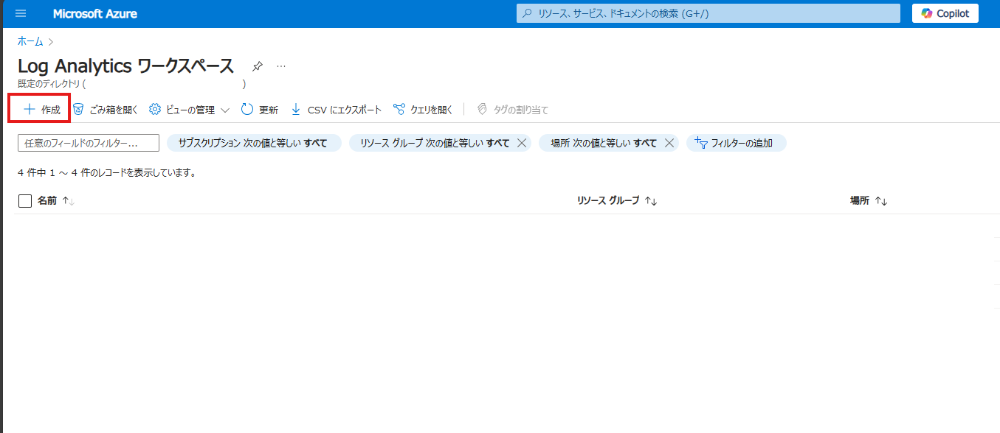

# 監視とセキュリティ

## 概要

この演習では、Azure 仮想マシンの監視とセキュリティの設定を行います。

## 作業手順

### Task 1 - Log Analytics ワークスペースの作成

- リソースグループ： azure-hands-on （作成したリソースグループを使用してください）
- ワークスペース名： work-logs 
- リージョン： Japan East

### Task 2 - 仮想マシン ログの有効化

#### Windows Server 2022 の場合

- データ収集ルール名：rule1
- プロセスと依存関係（マップ）を有効にする：有効
- Log Analytics ワークスペース：work-logs

#### Ubuntu 20.04 の場合

- データ収集ルール名：rule2
- プロセスと依存関係（マップ）を有効にする：有効
- Log Analytics ワークスペース：work-logs

### Task 3 - VM Insights の確認

#### Windows Server 2022 の場合

#### Ubuntu 20.04 の場合

TODO：Linuxのマップ取り忘れた

### Task 4 - Defender for Servers の有効化

## まとめ

この演習では、Azure 仮想マシンの監視とセキュリティの設定を行いました。

## 参考リンク

### 運用・監視関連
- [Azure Virtual Machines を監視する](https://learn.microsoft.com/ja-jp/azure/virtual-machines/monitor-vm?toc=%2Fazure%2Fvirtual-machines%2Ftoc.json)
- [VM insights の概要](https://learn.microsoft.com/ja-jp/azure/azure-monitor/vm/vminsights-overview)
- [Azure Monitor で仮想マシンを監視するベスト プラクティス](https://learn.microsoft.com/ja-jp/azure/azure-monitor/best-practices-vm)

### セキュリティ関連
- [Microsoft Defender for Cloud とは](https://learn.microsoft.com/ja-jp/azure/defender-for-cloud/defender-for-cloud-introduction)
- [Azure サブスクリプションを接続する](https://learn.microsoft.com/ja-jp/azure/defender-for-cloud/connect-azure-subscription)
- [Defender for Servers をデプロイする](https://learn.microsoft.com/ja-jp/azure/defender-for-cloud/tutorial-enable-servers-plan)
- [コンピューティング セキュリティに関する推奨事項](https://learn.microsoft.com/ja-jp/azure/defender-for-cloud/recommendations-reference-compute)
- [ネットワーク セキュリティに関する推奨事項](https://learn.microsoft.com/ja-jp/azure/defender-for-cloud/recommendations-reference-networking)
